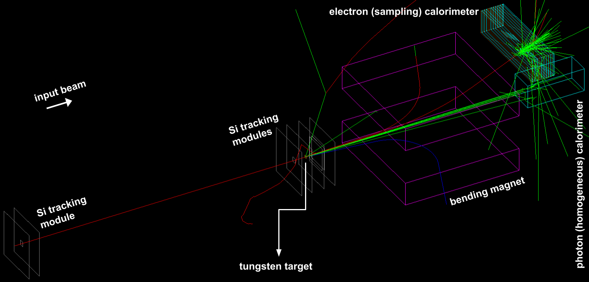

# succosim

This is **succosim**, a [Geant4](http://www.geant4.org/geant4/) blank template meant to be used as a starting point to create beamtest software simulations. It has been developed, starting from the material made available at the [VII International Geant4 School, Krakow](http://geant4.lngs.infn.it/krakow2019/), with a focus on the typical experimental configurations of the INSULAb group beamtests &mdash; see, for example, [here](https://indico.cern.ch/event/731649/contributions/3237202/) and [here](http://cds.cern.ch/record/2672249). The aim of the project is twofold:

- to provide a tool to validate the experimental results by comparing them with simulated data that are as similar as possible to the real ones;
- to provide a tool to easily reproduce the beamtest experimental condition in the simulations without the need for a developer-level knowledge of C++ and Geant4.

Nevertheless, a basic, user-level understanding of how a Geant4 simulation works is required in order to exploit succosim to its full potential. Moreover, both Geant4 and [CMake](https://cmake.org/) need to be installed on your machine in order to compile and run the software.

Tested with:

[](http://www.geant4.org/geant4/) [](https://cmake.org/)

The succosim source code can be downloaded either as a ZIP archive, from the Code drop-down menu [here](https://github.com/mattiasoldani/succosim), or directly from the terminal (open in your project working directory) via
```shell
git clone https://github.com/mattiasoldani/succosim.git
```
Note: the latter requires  [Git](https://git-scm.com/) installed on your machine.

Found a bug? Or simply have any questions, comments or suggestions you'd like to talk about? Feel free to contact me at <mattiasoldani93@gmail.com>. And brace yourself, for the best is yet to come!

---

### Settings

All the simulation details can be set in different parts of the source code: in particular, those on

- the name of the simulation executable that result from the compilation in `CMakeTLists.txt`;
- the experiment physical geometry, the magnetic fields and the detectors in `src/DetectorConstruct.cc` (and in `include/DetectorConstruct.hh`, if organising the `DetectorConstruction::Construct()` content into custom methods);
- the input particles in `src/PrimaryGeneratorAction.cc`;
- the so-called physics list, i.e. the library of particles and processes involved in the simulated radiation-matter interaction, in `main.cc` and, in case of a custom list defined manually, in `src/PhysicsList.cc`;
- the custom sensitive detectors, i.e. the physical object in the experimental setup that are given custom scoring features, in `include/CustomHit.hh`, `src/CustomHit.cc`, `include/CustomSD.hh` and `src/CustomSD.cc`;
- the output file format in `include/Analysis.hh` &mdash; see the dedicated section;
- the output ntuple structure in `src/RunAction.cc` &mdash; see the dedicated section;
- the scored data conditioning and the way the output ntuple is filled in `src/EventAction.cc` &mdash; see the dedicated section;
- the macro to be executed at the simulation startup in graphics mode in `main.cc`.

Details on all these settings can be found inside the source code files, in the comments. A fully set up test mode can be activated/deactivated by uncommenting/commenting the proper calls in `src/DetectorConstruct.cc`, `src/PrimaryGeneratorAction.cc`, `src/RunAction.cc` and `src/EventAction.cc` &mdash; see the dedicated section.

---

### Test mode

A test mode, comprehensive of the experimental setup, the input beam and the scoring system, can be activated/deactivated by uncommenting/commenting the proper calls in `src/DetectorConstruct.cc`, `src/PrimaryGeneratorAction.cc`, `src/RunAction.cc` and `src/EventAction.cc`. The test experiment is shown in the figure below; it comprises a 1 GeV/*c* electron beam with a square profile with a 1 cm side (right upstream with respect to the first tracking module box) and a divergence of 1 mrad impinging on a 1 *X<sub>0</sub>* thick tungsten cuboid with a 1 cm transverse side. A pair of silicon tracking sensors (with aluminum boxes) is placed upstream with respect to the target, whereas

- a larger-area tracking module,
- a bending magnet,
- a homogeneous calorimeter (a lead glass block) for photons and
- a sampling calorimeter (10 layers of lead and BC400 plastic scintillator) for (negative) charged particles

lie downstream. Such a configuration has been chosen to imitate the typical INSULAb beamtest one. All the detectors provide experimental-like data via the scoring system &mdash; see the dedicated section.

<p align="center">
    
</p>

---

### Output

succosim is optimised for an ntuple-based output, in which data from sensitive detectors are written on a periodic basis, e.g. step by step or event by event. The default output file format is the [ROOT](https://root.cern/) [file](https://root.cern/manual/storing_root_objects/) (`.root`), which contains the ntuples as [tree objects](https://root.cern.ch/doc/master/classTTree.html). The output file is saved in `out_data/` (in the build path) at the end of the program execution; its name can be set in `src/RunAction.cc`. Alternatively, different file formats can be chosen, e.g. the CSV, with the proper directive in `include/Analysis.hh`; note, however, that in general the custom file name (and path) will not be used to save output files that differ from the default ROOT one.

The list of variables (or columns) to be written in the ntuple is specified in `src/RunAction.cc`; each variable is given an integer as index, starting from 0 and counting, based on the creation order. The variables are then filled in `src/EventAction.cc`, being referred to using the aforementioned indexes rather than the chosen names; this can be done on a event-by-event basis or with more detail, e.g. step by step, depending on the structure of the data collections defined in the custom hits and sensitive detectors (in `include/CustomHit.hh`, `src/CustomHit.cc`, `include/CustomSD.hh` and `src/CustomSD.cc` &mdash; check comments therein and in the related test mode implementations, in `include/TestMode.cc`) and on the desired output information.

In the test mode, the event-by-event scoring of

- the event number within the run (column 0),
- the tracking modules hit multiplicities (columns 1-6) and hit positions (for the first generated hit inside the layer &mdash; columns 7-12) and
- the total energy deposited in the electron (column 13) and photon calorimeter (column 14)

is implemented; this data structure has been chosen to imitate the typical INSULAb one. Check in all the aforementioned source code files for details.
